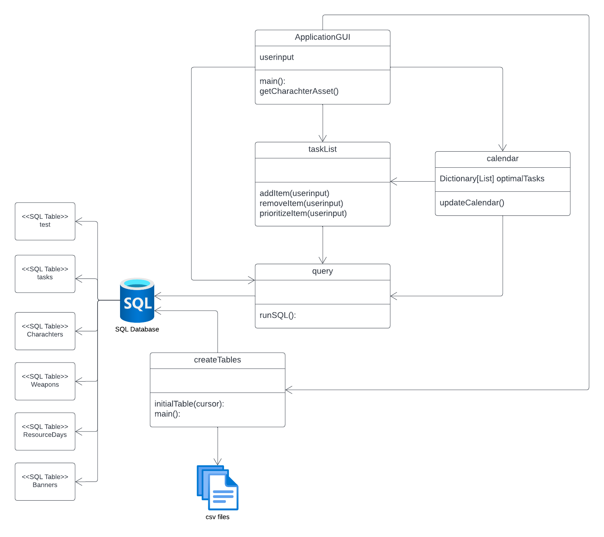

# GenshinHelpTool

## **Personal Project Goal:**
Create a full stack software that can help me play genshin better & improve my coding skills and knowledge.
The front end is developed with tkinter, the code is written with python and the database is postgreSQL

## **Genshin Task List Background Information:**
Resin is a valuable resource in Genshin Impact that is limited due to it only being accumulated with time. Resin can be used to farm materials and other items but oftentimes players use resin inefficiently because they do not have solid goals for what they want to farm. Farming materials on the right day is crucial because specific materials are only available on certain days, meaning if you miss that day the next time you can farm it may be in a few days which wastes time and resin.
This application hopes to help the player by being a list of all the long term/short term goals that you have for your account. You can add as many goals as you want but you can select the ones you want to focus on. By selecting a few of the most important goals, the program will create a weekly calendar of what material should be farmed on each day so it reflects the selected goals. 
## **Current things that have implementation complete:**
To do list is complete for charachter building priority
Gantt chart timeline for last time chgarachter run

## **Other plans for the project in the future would be implementing:**

Character Priority: (to identify what characters you want, a pity tracker for banners, and a counter for the last time a character got run on a banner)
Easy database updating for banner reruns/new charachters 
Gantt chart should tell you how many days since last rerun for a charachter

# Project UML Structure

# Project Documentation
All Installation Requirements for Project:
PostgreSQL 14.53 for Python 3.9, Create New Database in pgAdmin called 'genshin', set db password to 'dbpass'
pip install psycopg2 
pip install pandas
pip install plotly

Notes:
MySQL only works for older versions of vs code (2019) so I decided to learn PostgresSQL but within python its behavior is essentially the same.
